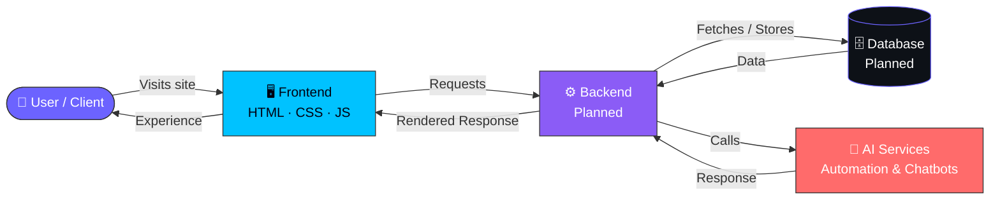

<div align="center">


<br/>

[](https://git.io/typing-svg)

<p>
<b>A modern digital solutions & technology agency</b> — crafting high-quality websites, scalable digital products, and AI-powered experiences for businesses that want to grow online.
</p>

<br/>

<!-- Badges -->
<p>


</p>

<p>


</p>

<p>

</p>

<a href="#-installation">Get Started</a> ·
<a href="#-features">Features</a> ·
<a href="#-project-preview">Preview</a> ·
<a href="mailto:waaditechno@gmail.com">Contact</a>

</div>

<br/>


<br/>

## 🪐 About Waadi Techno

<table>
<tr>
<td width="60%" valign="top">

Waadi Techno is a **digital solutions and technology agency** that helps businesses go from an idea to a fully launched, production-ready digital presence.

- 🎯 **What we do** — design, build, and maintain modern websites, e-commerce stores, landing pages, and AI-driven tools
- 👤 **Who it's for** — startups, small businesses, and brands that need a reliable tech partner without an in-house dev team
- ⚡ **Why it matters** — most agencies are slow or overpriced; we combine speed, modern design, and clean engineering
- 🌍 **Where we operate** — remote-first, working with clients across industries

</td>
<td width="40%" valign="top">

```txt
> whoami
Waadi Techno — Digital Agency

> mission
Deliver high-quality, affordable
digital solutions that look
stunning, perform reliably, and
help businesses grow online.

> status
Actively building 🚀
```

</td>
</tr>
</table>

<br/>

## ✨ Features

<div align="center">

| | Feature | Description |
|:---:|---|---|
| 🎨 | **Website Design** | Custom UI/UX with brand-focused, responsive layouts |
| 💻 | **Web Development** | Fast, secure, SEO-friendly builds on clean code |
| 🛒 | **E-Commerce** | Catalogs, carts & secure checkout, end to end |
| 🚀 | **Landing Pages** | Conversion-optimized pages built for campaigns |
| 🔧 | **Maintenance** | Updates, backups, bug fixes & content changes |
| 📊 | **Data Analytics** | Dashboards & visualizations that drive decisions |
| 🤖 | **AI Services** | Automation, custom AI solutions & smart chatbots |
| 📱 | **Social Media** | Strategy, content creation & audience growth |
| 🔍 | **SEO** | Keyword strategy, on-page SEO & ranking growth |

</div>

<br/>

## 🧭 Architecture / Workflow



<br/>

## 🛠️ Tech Stack

<div align="center">

**Frontend**


**Backend** <sub>(planned)</sub>


**AI / ML**


**Database** <sub>(planned)</sub>


**Deployment & Tools**


</div>

<br/>

## 🖼️ Project Preview

<div align="center">

<!-- Replace the src links below with your actual screenshot URLs -->

**Desktop Preview**


**Mobile Preview**


**Dashboard Preview** <sub>(planned)</sub>


</div>

<br/>

## ⚙️ Installation

```bash
# Clone the repository
git clone https://github.com/your-username/waadi-techno.git

# Move into the project directory
cd waadi-techno

# (Optional) install dependencies if using a build tool
npm install

# Run locally
npm run dev
```

> 💡 This is currently a static HTML/CSS/JS site — you can also just open `index.html` in your browser or serve it with **VS Code Live Server**.

<br/>

## 🔐 Environment Variables

Create a `.env` file in the root directory. *(Reserved for future backend/AI integration.)*

| Variable | Description |
|---|---|
| `SITE_URL` | Public URL the site is deployed on |
| `CONTACT_EMAIL` | Email used for the contact form / inquiries |
| `AI_API_KEY` | API key for AI chatbot / automation features |
| `ANALYTICS_ID` | Analytics tracking ID (e.g. GA4) |

<br/>

## 🚀 Usage

1. 📂 Clone or download the repository
2. 🖊️ Customize content in `index.html` and `assets/`
3. 🎨 Update branding, images, and copy under `assets/images/`
4. 🌐 Deploy to your platform of choice (Vercel, Netlify, GitHub Pages)
5. 📧 Update contact details to route inquiries to your team

<br/>

## 📁 Folder Structure

```text
waadi-techno/
│
├── index.html
│
├── assets/
│   ├── css/
│   │   └── style.css
│   ├── js/
│   │   └── script.js
│   ├── images/
│   │   ├── logo/
│   │   ├── hero/
│   │   ├── services/
│   │   ├── portfolio/
│   │   └── team/
│   └── icons/
│
└── README.md
```

<br/>

## 🗺️ Roadmap

- [x] Modern responsive website
- [x] Service showcase sections
- [x] Team & portfolio sections
- [ ] 🤖 AI Project Planner
- [ ] 💬 Smart AI Chat Assistant
- [ ] 📧 Automated Inquiry Responses
- [ ] 📊 Client Dashboard
- [ ] 🔐 Authentication System
- [ ] 🗄️ Database Integration
- [ ] 📈 Advanced Analytics
- [ ] 📝 Blog & Content System
- [ ] 🌙 Dark / Light Mode
- [ ] 📅 Consultation Booking System

<br/>

## 🤝 Contribution

Contributions are welcome! To contribute:

```bash
# 1. Fork the repository

# 2. Create a new branch
git checkout -b feature/your-feature-name

# 3. Commit your changes
git commit -m "Add: your feature description"

# 4. Push to your branch
git push origin feature/your-feature-name

# 5. Open a Pull Request
```

<br/>

## 👨‍💻 Team

<div align="center">

<table>
<tr>
<td align="center" width="33%">
<b>Muhammad Umar</b><br/>
<sub>Founder / Full-Stack Developer</sub>
</td>
<td align="center" width="33%">
<b>Abdul Gani</b><br/>
<sub>Data Scientist</sub>
</td>
<td align="center" width="33%">
<b>Faizan Khimani</b><br/>
<sub>Developer & Client Management</sub>
</td>
</tr>
</table>

<p>
<a href="mailto:waaditechno@gmail.com"></a>
<a href="#"></a>
<a href="#"></a>
<a href="https://github.com/your-username"></a>
</p>

</div>

<br/>


<div align="center">

### 💜 Thank you for visiting Waadi Techno

Built with ❤️ by the Waadi Techno team

**© 2026 Waadi Techno — Building Digital Experiences for the Future.**

<a href="#-waadi-techno">⬆ Back to Top</a>

</div>
